# Dunhayat Coffee Roastery API

A clean and performant Go backend for Dunhayat (دان حیات) coffee roastery's
e-commerce system, built with Clean and Hexagonal Architecture principles.
The system employs vertical slicing to ensure domain-driven separation of
concerns, with clear delineation between business logic, use cases, and
infrastructure components for optimal maintainability and testability.

## Architecture

This project follows **vertical slicing** architecture where each domain
(auth, orders, payments, products, users) is self-contained with its own:
- Domain entities and object values (pure domain layer)
- Use cases (application layer) 
- HTTP handlers (delivery layer)
- Repository implementations (data access layer)
- Port interfaces for cross-domain communication (ports and adapters)

**Infrastructure layer** (`pkg/`): Shared cross-cutting concerns including
configuration management, database connections, Redis client, logging, HTTP
routing, and external service providers.

**Dependency direction**: `domain` ← `usecase` ← adapters (`http`,
`repository`) ← `infrastructure` (`pkg/`). Inner layers do not depend
on outer layers.

**Port interfaces**: Cross-domain communication uses port interfaces in
`internal/<slice>/port/` with concrete adapters in `internal/<slice>/adapter/`.

**Infrastructure**: Shared concerns live in `pkg/` (`config`, `database`,
`redis`, `logger`, `router`, `payment`, `sms`) and are treated as
infrastructure.

**Migrations**: Database schema changes are managed with Atlas.

## Tech Stack

- **Language**: Go 1.25+
- **Framework**: Fiber v2 (HTTP framework)
- **Configuration**: Viper
- **Database**: PostgreSQL with GORM (user data, orders, products, payments)
- **Migrations**: Atlas (schema management)
- **Cache/Storage**: Redis (OTP codes, session management)
- **Logging**: Zap (structured logging)

## Project Structure

```hier
┌── api/              # OpenAPI documents
├── cmd/              # Entrypoints
│   └── api/          # Main application
├── internal/         # Domain-specific code (vertical slices)
│   ├── auth/         # Authentication domain (OTP, sessions)
│   ├── orders/       # Order domain (sales, cart reservations)
│   ├── payments/     # Payment domain (Zibal integration)
│   ├── products/     # Product domain (coffee products)
│   └── users/        # User domain (profiles, addresses)
├── migrations/       # Atlas migration files
├── pkg/              # Shared utilities
│   ├── config/       # Configuration management (Viper)
│   ├── database/     # Database utilities (PostgreSQL)
│   ├── logger/       # Logging utilities (Zap)
│   ├── payment/      # Payment service (Zibal)
│   ├── redis/        # Redis connection utilities
│   ├── router/       # HTTP routing (Fiber)
│   └── sms/          # SMS service (Kavenegar)
├── atlas.hcl         # Atlas configuration
├── config.yaml       # Application settings
├── go.mod, go.sum    # Go module dependencies
├── Makefile          # Development commands
└── README.md         # Documentation
```

## Quick Start

### Prerequisites

- **Go 1.25+**
- **PostgreSQL 17+**
- **Redis 7+**
- **Atlas CLI** (installed with `go install`, `brew`, or package manager of
  your choice)

### Configuration Setup

The application uses Viper for configuration management, which supports:
- YAML configuration files
- Environment variables
- Default values
- Hot reloading (can be enabled)

To set up, copy the configuration template (`config.yaml.example`) to
`config.yaml`, and modify it as required.

### Database Setup

1. Create the database:
```sql
CREATE DATABASE dunhayat;
```

2. Apply database migrations using Atlas:
```sh
# Apply migrations
make migrate

# Check migration status
make migrate-status
```

### Migration Workflow

1. **Create Migration**: `make migrate-new name=description`
2. **Edit Migration**: Modify the generated SQL file in `migrations/`
3. **Apply Migration**: `make migrate`
4. **Verify Status**: `make migrate-status`

### Redis Setup

Install Redis with the package manager of your choice, and start the service.

### Build and Fly

Consult the [`Makefile`](./Makefile) and proceed to get airborne.

## Database Schema

Check out the
[initial database schema](migrations/20250828055134_initial_schema.sql).

## API Endpoints

The API provides the following endpoints:

- **Authentication**: `/api/v1/auth/` - OTP request/verification and logout
- **Products**: `/api/v1/products/` - CRUD for products
- **Orders**: `/api/v1/orders/` - Create orders (requires authentication)
- **Payments**: `/api/v1/payments/` - Payment initiation, verification,
  callbacks

Interactive Swagger documentation is available in development mode
at `/swagger/`.

## **OTP Flow**
```
1. User requests OTP
   ↓
2. Backend generates "123456"
   ↓
3. Backend saves to Redis: key="otp:+989123456789", value=OTP_JSON, TTL=600s
   ↓
4. Backend tells Kavenegar: "Send SMS with code 123456"
   ↓
5. Kavenegar sends SMS to user
   ↓
6. User types "123456" in frontend
   ↓
7. Frontend sends to backend: phone="+989123456789", code="123456"
   ↓
8. Backend fetches from Redis: "What's the OTP for +989123456789?"
   ↓
9. Backend compares: "123456" == "123456" ✓
   ↓
10. Backend creates user session, returns token
   ↓
11. Redis automatically removes OTP after 10 minutes
   ↓
12. User could proceed with their purchase etc.
```

## Business Logic Flow

The following diagram illustrates the complete business flow from user
authentication to order completion:

```mermaid
flowchart TD
      %% User Authentication Flow
      A[User opens app] --> B{Has valid session?}
      B --> C[Enter phone number]
      B --> M[Browse products]
      
      C --> D[Request OTP]
      D --> E[Generate 6-digit OTP]
      E --> F[Save OTP to Redis<br/>TTL: 10 minutes]
      F --> G[Send SMS via Kavenegar]
      G --> H[User enters OTP]
      H --> I{OTP valid?}
      I --> J[Show error]
      I --> K[Create user session]
      K --> L[Generate auth token]
      L --> M[Browse products]
      
      %% Product Browsing
      M --> N[List/Filter products]
      N --> O[Select product]
      O --> P[Add to cart]
      
      %% Order Creation Flow
      P --> Q[Create order]
      Q --> R[Validate products & stock]
      R --> S{Stock available?}
      S --> T[Show out of stock]
      S --> U[Create cart reservation<br/>TTL: 10 minutes]
      U --> V[Update product stock]
      V --> W[Create sale record]
      W --> X[Create sale items]
      
      %% Payment Flow
      X --> Y[Initiate payment]
      Y --> Z[Create Zibal payment request]
      Z --> AA[Get payment gateway URL]
      AA --> BB[Set tracking code on sale]
      BB --> CC[Return payment info to user]
      CC --> DD[Redirect to Zibal gateway]
      
      %% Payment Processing
      DD --> EE[User pays on gateway]
      EE --> FF{Payment successful?}
      FF --> GG[Payment callback: failed]
      FF --> HH[Payment callback: success]
      
      GG --> II[Update sale status: failed]
      HH --> JJ[Verify payment with Zibal]
      JJ --> KK[Update sale status: paid]
      KK --> LL[Order complete]
      
      %% Error Handling & Timeouts
      U --> MM{Reservation expires?}
      MM -->|Expired| NN[Restore product stock]
      MM -->|Active| OO[Keep reservation active]
      
      %% Link styling - all flows light green except specific negative flows in light red
      linkStyle 0  stroke:#81c784,stroke-width:3px
      linkStyle 1  stroke:#81c784,stroke-width:3px
      linkStyle 2  stroke:#81c784,stroke-width:3px
      linkStyle 3  stroke:#81c784,stroke-width:3px
      linkStyle 4  stroke:#81c784,stroke-width:3px
      linkStyle 5  stroke:#81c784,stroke-width:3px
      linkStyle 6  stroke:#81c784,stroke-width:3px
      linkStyle 7  stroke:#81c784,stroke-width:3px
      linkStyle 8  stroke:#81c784,stroke-width:3px
      linkStyle 9  stroke:#e57373,stroke-width:3px
      linkStyle 10 stroke:#81c784,stroke-width:3px
      linkStyle 11 stroke:#81c784,stroke-width:3px
      linkStyle 12 stroke:#81c784,stroke-width:3px
      linkStyle 13 stroke:#81c784,stroke-width:3px
      linkStyle 14 stroke:#81c784,stroke-width:3px
      linkStyle 15 stroke:#81c784,stroke-width:3px
      linkStyle 16 stroke:#81c784,stroke-width:3px
      linkStyle 17 stroke:#81c784,stroke-width:3px
      linkStyle 18 stroke:#81c784,stroke-width:3px
      linkStyle 19 stroke:#e57373,stroke-width:3px
      linkStyle 20 stroke:#81c784,stroke-width:3px
      linkStyle 21 stroke:#81c784,stroke-width:3px
      linkStyle 22 stroke:#81c784,stroke-width:3px
      linkStyle 23 stroke:#81c784,stroke-width:3px
      linkStyle 24 stroke:#81c784,stroke-width:3px
      linkStyle 25 stroke:#81c784,stroke-width:3px
      linkStyle 26 stroke:#81c784,stroke-width:3px
      linkStyle 27 stroke:#81c784,stroke-width:3px
      linkStyle 28 stroke:#81c784,stroke-width:3px
      linkStyle 29 stroke:#81c784,stroke-width:3px
      linkStyle 30 stroke:#81c784,stroke-width:3px
      linkStyle 31 stroke:#81c784,stroke-width:3px
      linkStyle 32 stroke:#e57373,stroke-width:3px
      linkStyle 33 stroke:#81c784,stroke-width:3px
      linkStyle 34 stroke:#e57373,stroke-width:3px
      linkStyle 35 stroke:#81c784,stroke-width:3px
      linkStyle 36 stroke:#81c784,stroke-width:3px
      linkStyle 37 stroke:#81c784,stroke-width:3px
      linkStyle 38 stroke:#81c784,stroke-width:3px
      linkStyle 39 stroke:#81c784,stroke-width:3px
      linkStyle 40 stroke:#81c784,stroke-width:3px
      
      %% Styling with high contrast colors
      classDef authFlow     fill:#1565c0,stroke:#0d47a1,stroke-width:3px,color:#ffffff
      classDef productFlow  fill:#7b1fa2,stroke:#4a148c,stroke-width:3px,color:#ffffff
      classDef orderFlow    fill:#2e7d32,stroke:#1b5e20,stroke-width:3px,color:#ffffff
      classDef paymentFlow  fill:#ef6c00,stroke:#e65100,stroke-width:3px,color:#ffffff
      classDef errorFlow    fill:#c62828,stroke:#b71c1c,stroke-width:3px,color:#ffffff
      classDef decisionFlow fill:#37474f,stroke:#263238,stroke-width:3px,color:#ffffff
      
      class A,B,C,D,E,F,G,H,I,J,K,L authFlow
      class M,N,O,P productFlow
      class Q,R,S,T,U,V,W,X orderFlow
      class Y,Z,AA,BB,CC,DD,EE,FF,GG,HH,II,JJ,KK,LL paymentFlow
      class MM,NN,OO errorFlow
      class B,I,S,FF,MM decisionFlow
```



## Future Enhancements

- User profile management
- Purchase history and order tracking
- Email verification
- Admin dashboard
- Inventory management
- Advanced Redis caching for products and user data

_...and the sky's the limit..._

## 📝 License

Dunhayat API is originally developed for Dunhayat Coffee Roastery and released
under the **Business Source License 1.1 (BSL 1.1)**. 

- Free for non-production, educational, personal, and internal use.
- Commercial production use (that is operating an e-commerce site or other
  revenue-generating service) requires a commercial licence from the author.

After the **Change Date** (two years from the first public release of any
version), the software will be relicensed under the **Apache License 2.0**.

For full licence terms, including conditions for commercial use, please consult
the [LICENSE](./LICENSE) file.

For commercial licensing enquiries,
[contact the author](mailto:kfv@kfv.io?subject=Commercial%20License%20Enquiry%20-%20Dunhayat%20API).
